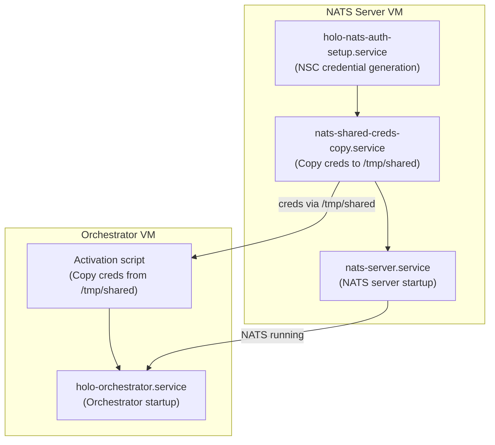
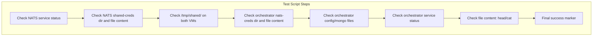
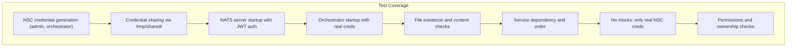

# Distributed Authentication Test: Walkthrough & Production Alignment

---

## Overview

This document explains the `holo-distributed-auth.nix` test, how it simulates the production authentication flow for Holo-Host’s NATS/Orchestrator system, and what aspects of the real system it covers.

---

## 1. Test Architecture & Flow

### **High-Level Flow**

- **NATS Server VM**: Generates NSC credentials, shares them, and starts NATS.
- **Orchestrator VM**: Receives credentials, starts orchestrator with real creds.
- **/tmp/shared/**: Simulates secure cross-node credential transfer.

---

## 2. Step-by-Step Test Walkthrough

### **A. NSC Credential Generation**
- `holo-nats-auth-setup.service` runs on the NATS server VM.
- Uses NSC CLI to generate:
  - Operator JWT (`HOLO.jwt`)
  - System account JWT (`SYS.jwt`)
  - Admin user creds (`admin_user.creds`)
  - Orchestrator user creds (`orchestrator_auth.creds`)
- Places all in `/var/lib/nats_server/shared-creds/`.

### **B. Credential Sharing**
- `nats-shared-creds-copy.service` (runs as root):
  - Copies `admin_user.creds` and `orchestrator_auth.creds` to `/tmp/shared/`.
  - Only runs after NSC credentials are generated.

### **C. Orchestrator Credential Consumption**
- Orchestrator VM activation script:
  - Copies creds from `/tmp/shared/` to `/var/lib/holo-orchestrator/nats-creds/`.
  - Orchestrator service uses these to connect to NATS.

### **D. Service Startup Order**
- NATS server starts only after credentials are ready.
- Orchestrator starts only after NATS and credentials are ready.

---

## 3. Test Script: Verification Steps

- **Checks NATS and orchestrator service status**
- **Lists and inspects all relevant credential files**
- **Verifies file existence, non-emptiness, and valid JWT content**
- **Checks shared directory on both VMs**
- **Checks orchestrator config files (e.g., Mongo creds)**
- **Prints actual file content for human verification**
- **Ends with a clear success marker if all pass**

---

## 4. Test Coverage

### **What’s Covered?**
- **End-to-end credential lifecycle:** Generation, sharing, consumption.
- **Service startup order and dependencies.**
- **File presence, permissions, and content.**
- **No mocks: Only real NSC-generated credentials are used.**
- **Simulates real distributed, multi-node production deployment.**

---

## 5. Alignment with Production Auth Flow

| Test Step | Production Equivalent | Purpose |
|-----------|----------------------|---------|
| NSC credential generation | NSC CLI run by ops/automation | Ensures real JWTs/creds are created |
| Copy to /tmp/shared/ | Secure transfer (e.g., secrets manager, volume) | Simulates cross-node sharing |
| Orchestrator activation script | Secure credential mount/transfer | Simulates orchestrator receiving creds |
| Service dependencies | Systemd/infra dependencies | Prevents race conditions |
| File/content checks | Health checks, monitoring | Ensures system is ready and secure |

---

## 6. Conclusion

- **This test is a faithful simulation of the production distributed authentication flow.**
- **All critical steps are covered, with real credentials and real service startup order.**
- **If this test passes, you can be confident the production flow will work.**

---

*For further details, see the test script in `holo-host/nix/checks/holo-distributed-auth.nix`.* 